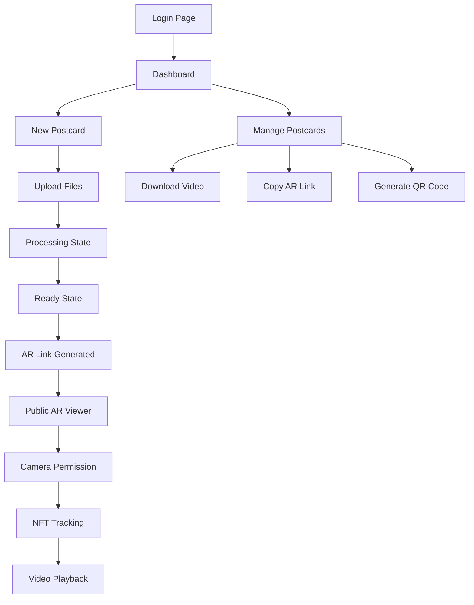

# Documentación de Requerimientos - AR Postcard App

## 1. Product Overview

Aplicación web de realidad aumentada que permite a usuarios autenticados subir imágenes target y videos para crear experiencias AR interactivas. Los usuarios pueden generar "postcards" digitales donde el video se reproduce anclado sobre la imagen física cuando se apunta con la cámara del móvil.

El producto resuelve la necesidad de crear contenido AR personalizado de forma sencilla, dirigido a creadores de contenido, marketers y usuarios que buscan experiencias inmersivas. El valor del mercado se centra en la democratización de la tecnología AR sin requerir conocimientos técnicos avanzados.

## 2. Core Features

### 2.1 User Roles

| Role               | Registration Method                 | Core Permissions                                                |
| ------------------ | ----------------------------------- | --------------------------------------------------------------- |
| Authenticated User | Clerk authentication (email/social) | Crear, listar, gestionar postcards propias, acceder a dashboard |
| Anonymous User     | No registration                     | Solo acceso público a visor AR en rutas /ar/\[postcardId]       |

### 2.2 Feature Module

Nuestra aplicación AR consta de las siguientes páginas principales:

1. **Dashboard**: listado de postcards del usuario, estados de procesamiento, acciones de gestión
2. **New Postcard**: formulario de subida de imagen target y video, validaciones en tiempo real
3. **AR Viewer**: visor público WebAR con tracking NFT y reproducción de video anclado

### 2.3 Page Details

| Page Name    | Module Name       | Feature description                                                                                    |
| ------------ | ----------------- | ------------------------------------------------------------------------------------------------------ |
| Dashboard    | Postcard List     | Mostrar grid de postcards con thumbnails, estados (processing/ready/error), fechas de creación         |
| Dashboard    | Action Controls   | Copiar link AR, generar código QR, descargar video, eliminar postcard                                  |
| Dashboard    | Status Indicators | Badges visuales para estados, progress bars para procesamiento, error messages                         |
| New Postcard | File Upload       | Drag & drop para imagen (jpg/png) y video (mp4), preview inmediato, validación de formato y tamaño     |
| New Postcard | Validation Engine | Verificar resolución mínima 800px, contraste de imagen, límite 80MB video, mostrar errores específicos |
| New Postcard | Progress Tracking | Barra de progreso de subida, estados de procesamiento NFT, notificaciones toast                        |
| AR Viewer    | Camera Access     | Solicitar permisos de cámara, inicializar webcam, manejar errores de acceso                            |
| AR Viewer    | NFT Tracking      | Cargar descriptores AR.js, detectar imagen target, anclar video en posición 3D                         |
| AR Viewer    | Video Playback    | Reproducir video con aspect ratio correcto, controles de audio para iOS, loop automático               |
| AR Viewer    | Download Option   | Botón flotante para descargar video original, signed URL temporal                                      |

## 3. Core Process

**Flujo Usuario Autenticado:**

1. Login con Clerk → Dashboard principal
2. Crear nueva postcard → Subir imagen target y video
3. Validación automática → Estado "processing"
4. Generación NFT completada → Estado "ready" con link AR
5. Compartir link público → Acceso desde móvil
6. Apuntar cámara a imagen física → Video aparece en AR

**Flujo Usuario Anónimo:**

1. Acceder a link /ar/\[postcardId] desde móvil
2. Permitir acceso a cámara → Cargar visor AR
3. Apuntar a imagen target → Video se reproduce anclado
4. Opción de descargar video original

**Flujo Sistema Backend:**

1. POST /api/postcards → Crear registro y signed URLs
2. Subida directa a Supabase Storage → Trigger job NFT
3. POST /api/nft/generate → Procesar imagen, generar descriptores
4. Actualizar estado y paths → Notificar usuario

## 4. User Interface Design

### 4.1 Design Style

* **Colores primarios**: Ocean Breeze theme con primary oklch(0.7227 0.1920 149.5793) y background oklch(0.9751 0.0127 244.2507)

* **Colores secundarios**: Secondary oklch(0.9514 0.0250 236.8242) para elementos de apoyo

* **Estilo de botones**: Rounded con radius 0.5rem, efectos hover suaves, estados disabled claros

* **Tipografía**: DM Sans para sans-serif, IBM Plex Mono para código, Lora para serif decorativo

* **Layout**: Card-based design con grid responsivo, navegación top con sidebar opcional

* **Iconos**: Lucide icons con estilo outline, tamaño consistente 20-24px, colores temáticos

### 4.2 Page Design Overview

| Page Name    | Module Name   | UI Elements                                                                          |
| ------------ | ------------- | ------------------------------------------------------------------------------------ |
| Dashboard    | Header        | UserButton de Clerk, título "My AR Postcards", botón "Create New" con primary color  |
| Dashboard    | Postcard Grid | Cards con aspect ratio 16:9, thumbnail de imagen, badge de estado, acciones en hover |
| Dashboard    | Empty State   | Ilustración central, texto motivacional, CTA prominente para crear primera postcard  |
| New Postcard | Upload Zone   | Área drag & drop con border dashed, iconos de file types, progress indicators        |
| New Postcard | Preview Panel | Vista previa lado a lado, validación en tiempo real con iconos check/error           |
| New Postcard | Form Controls | Botones Cancel/Upload con estados loading, toast notifications para feedback         |
| AR Viewer    | Camera View   | Fullscreen viewport, overlay UI mínimo, botón download flotante                      |
| AR Viewer    | Loading State | Spinner central, texto "Initializing camera...", progress steps                      |
| AR Viewer    | Error States  | Mensajes claros para permisos denegados, imagen no detectada, errores de carga       |

### 4.3 Responsiveness

Diseño mobile-first con adaptación desktop. Optimización táctil para móviles en visor AR, navegación por gestos, botones de tamaño mínimo 44px. Desktop mantiene layout de sidebar con mayor densidad de información.

## 5. Technical Specifications

### 5.1 Authentication & Security

* Clerk authentication con middleware en todas las rutas protegidas

* Supabase RLS policies para acceso a datos por user\_id

* Signed URLs temporales para acceso a archivos privados

* CORS configurado para dominios específicos

### 5.2 File Processing

* Validación client-side: formato, tamaño, resolución

* Validación server-side: headers, contenido, metadata

* Compresión opcional de video en Edge Functions

* Generación de thumbnails automática

### 5.3 AR Implementation

* AR.js con A-Frame para tracking NFT

* Generación de descriptores .

