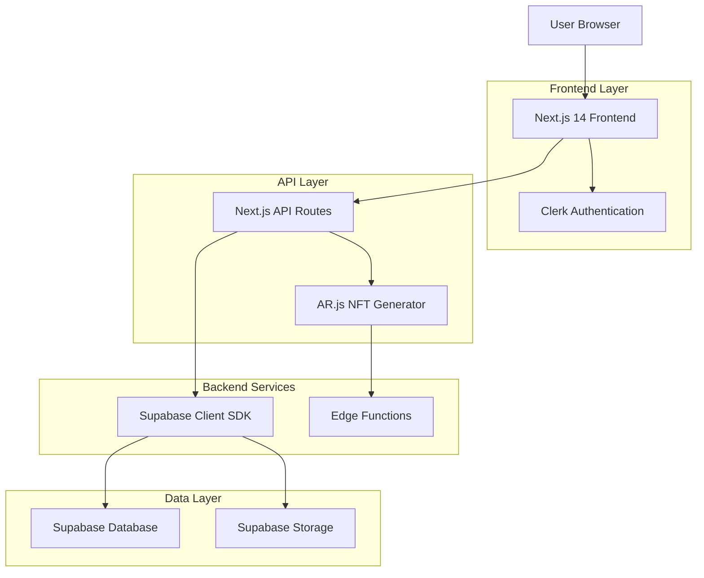
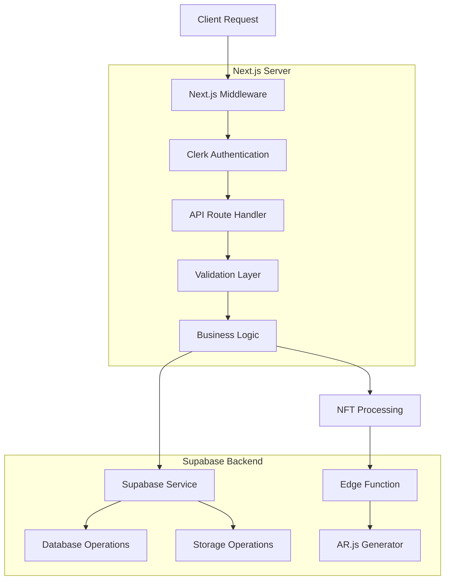
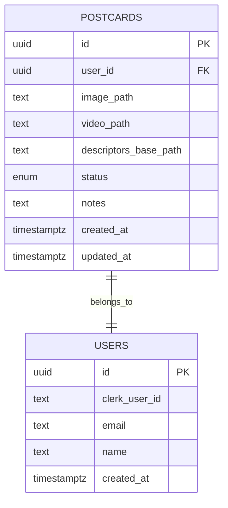

# Arquitectura Técnica - AR Postcard App

## 1. Architecture Design



## 2. Technology Description

* **Frontend**: Next.js\@14 + TypeScript\@5 + Tailwind\@4 + shadcn/ui + Framer Motion

* **Authentication**: Clerk\@latest con middleware y server utilities

* **Backend**: Next.js API Routes + Supabase Edge Functions

* **Database**: Supabase PostgreSQL con Row Level Security

* **Storage**: Supabase Storage con buckets privados

* **AR Engine**: AR.js + A-Frame para NFT tracking

* **Styling**: Ocean Breeze theme con CSS variables

* **Development**: ESLint + Prettier + TypeScript strict

## 3. Route Definitions

| Route                | Purpose                                                   |
| -------------------- | --------------------------------------------------------- |
| /                    | Landing page con información del producto y CTA de login  |
| /dashboard           | Dashboard principal con listado de postcards del usuario  |
| /dashboard/new       | Formulario de creación de nueva postcard con upload       |
| /ar/\[postcardId]    | Visor público WebAR para experiencia inmersiva            |
| /api/postcards       | API para crear nuevas postcards y obtener signed URLs     |
| /api/postcards/\[id] | API para obtener metadata y assets de postcard específica |
| /api/nft/generate    | API para procesar imagen y generar descriptores NFT       |

## 4. API Definitions

### 4.1 Core API

**Crear nueva postcard**

```
POST /api/postcards
```

Request:

| Param Name | Param Type | isRequired | Description                                    |
| ---------- | ---------- | ---------- | ---------------------------------------------- |
| imageFile  | File       | true       | Imagen target JPG/PNG, mínimo 800px lado corto |
| videoFile  | File       | true       | Video MP4 H264, máximo 80MB                    |

Response:

| Param Name     | Param Type | Description                  |
| -------------- | ---------- | ---------------------------- |
| postcardId     | string     | UUID de la postcard creada   |
| imageUploadUrl | string     | Signed URL para subir imagen |
| videoUploadUrl | string     | Signed URL para subir video  |
| status         | string     | Estado inicial "processing"  |

Example Response:

```json
{
  "postcardId": "123e4567-e89b-12d3-a456-426614174000",
  "imageUploadUrl": "https://supabase.co/storage/v1/upload/...",
  "videoUploadUrl": "https://supabase.co/storage/v1/upload/...",
  "status": "processing"
}
```

**Obtener postcard pública**

```
GET /api/postcards/[id]
```

Response:

| Param Name     | Param Type | Description                              |
| -------------- | ---------- | ---------------------------------------- |
| id             | string     | UUID de la postcard                      |
| status         | string     | Estado actual (ready, processing, error) |
| videoUrl       | string     | Signed URL temporal para video           |
| descriptorsUrl | string     | Signed URL base para descriptores NFT    |
| createdAt      | string     | Timestamp de creación                    |

**Generar descriptores NFT**

```
POST /api/nft/generate
```

Request:

| Param Name | Param Type | isRequired | Description                    |
| ---------- | ---------- | ---------- | ------------------------------ |
| postcardId | string     | true       | UUID de la postcard a procesar |

Response:

| Param Name      | Param Type | Description                             |
| --------------- | ---------- | --------------------------------------- |
| success         | boolean    | Resultado del procesamiento             |
| status          | string     | Nuevo estado de la postcard             |
| descriptorsPath | string     | Path base de los descriptores generados |

## 5. Server Architecture Diagram



## 6. Data Model

### 6.1 Data Model Definition



### 6.2 Data Definition Language

**Tabla Postcards**

```sql
-- Crear enum para estados
CREATE TYPE postcard_status AS ENUM ('processing', 'ready', 'needs_better_image', 'error');

-- Crear tabla postcards
CREATE TABLE postcards (
    id UUID PRIMARY KEY DEFAULT gen_random_uuid(),
    user_id UUID NOT NULL,
    image_path TEXT NOT NULL,
    video_path TEXT NOT NULL,
    descriptors_base_path TEXT,
    status postcard_status DEFAULT 'processing',
    notes TEXT,
    created_at TIMESTAMPTZ DEFAULT NOW(),
    updated_at TIMESTAMPTZ DEFAULT NOW()
);

-- Crear índices para optimización
CREATE INDEX idx_postcards_user_id ON postcards(user_id);
CREATE INDEX idx_postcards_status ON postcards(status);
CREATE INDEX idx_postcards_created_at ON postcards(created_at DESC);

-- Habilitar RLS
ALTER TABLE postcards ENABLE ROW LEVEL SECURITY;

-- Política para usuarios autenticados (owner access)
CREATE POLICY "owner_read_write" ON postcards
    FOR ALL USING (auth.uid()::text = user_id::text)
    WITH CHECK (auth.uid()::text = user_id::text);

-- Política para acceso público de lectura (solo para visor AR)
CREATE POLICY "public_read_ready" ON postcards
    FOR SELECT USING (status = 'ready');

-- Función para actualizar updated_at automáticamente
CREATE OR REPLACE FUNCTION update_updated_at_column()
RETURNS TRIGGER AS $$
BEGIN
    NEW.updated_at = NOW();
    RETURN NEW;
END;
$$ language 'plpgsql';

-- Trigger para updated_at
CREATE TRIGGER update_postcards_updated_at
    BEFORE UPDATE ON postcards
    FOR EACH ROW
    EXECUTE FUNCTION update_updated_at_column();
```

**Configuración Storage**

```sql
-- Crear bucket privado para postcards
INSERT INTO storage.buckets (id, name, public)
VALUES ('postcards', 'postcards', false);

-- Política de storage para usuarios autenticados
CREATE POLICY "authenticated_upload" ON storage.objects
    FOR INSERT WITH CHECK (
        bucket_id = 'postcards' AND 
        auth.role() = 'authenticated' AND
        (storage.foldername(name))[1] = auth.uid()::text
    );

CREATE POLICY "authenticated_read" ON storage.objects
    FOR SELECT USING (
        bucket_id = 'postcards' AND 
        auth.role() = 'authenticated' AND
        (storage.foldername(name))[1] = auth.uid()::text
    );

-- Política para acceso público con signed URLs
CREATE POLICY "public_signed_access" ON storage.objects
    FOR SELECT USING (bucket_id = 'postcards');
```

**Datos iniciales**

```sql
-- Ejemplo de postcard de demostración
INSERT INTO postcards (
    user_id, 
    image_path, 
    video_path, 
    descriptors_base_path, 
    status, 
    notes
) VALUES (
    '00000000-0000-0000-0000-000000000000',
    'postcards/demo/demo-postcard/image.jpg',
    'postcards/demo/demo-postcard/video.mp4',
    'postcards/demo/demo-postcard/nft/',
    'ready',
    'Demo postcard for testing AR functionality'
);
```

## 7. Environment Configuration

### 7.1 Required Environment Variables

```env
# Clerk Authentication
NEXT_PUBLIC_CLERK_PUBLISHABLE_KEY=pk_test_...
CLERK_SECRET_KEY=sk_test_...
NEXT_PUBLIC_CLERK_SIGN_IN_URL=/sign-in
NEXT_PUBLIC_CLERK_SIGN_UP_URL=/sign-up
NEXT_PUBLIC_CLERK_AFTER_SIGN_IN_URL=/dashboard
NEXT_PUBLIC_CLERK_AFTER_SIGN_UP_URL=/dashboard

# Supabase
NEXT_PUBLIC_SUPABASE_URL=https://your-project.supabase.co
NEXT_PUBLIC_SUPABASE_ANON_KEY=eyJ...
SUPABASE_SERVICE_ROLE_KEY=eyJ...

# App Configuration
NEXT_PUBLIC_APP_URL=https://your-domain.com
MAX_FILE_SIZE_MB=80
MIN_IMAGE_RESOLUTION=800

# AR.js Configuration
NEXT_PUBLIC_AR_DEBUG=false
NFT_GENERATION_TIMEOUT=300000
```

### 7.2 Deployment Configuration

* **Vercel**: Configuración automática con Next.js 14

* **Edge Functions**: Deploy en Supabase para procesamiento NFT

* **HTTPS**: Requerido para acceso a cámara en móviles

* **CORS**: Configurado para dominios específicos

* **CDN**: Assets estáticos servidos desde Vercel Edge Network

